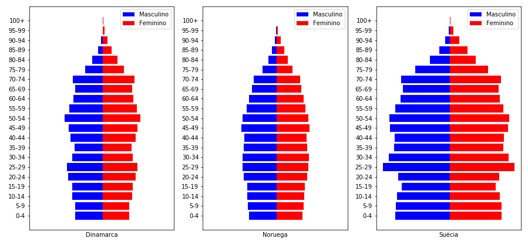
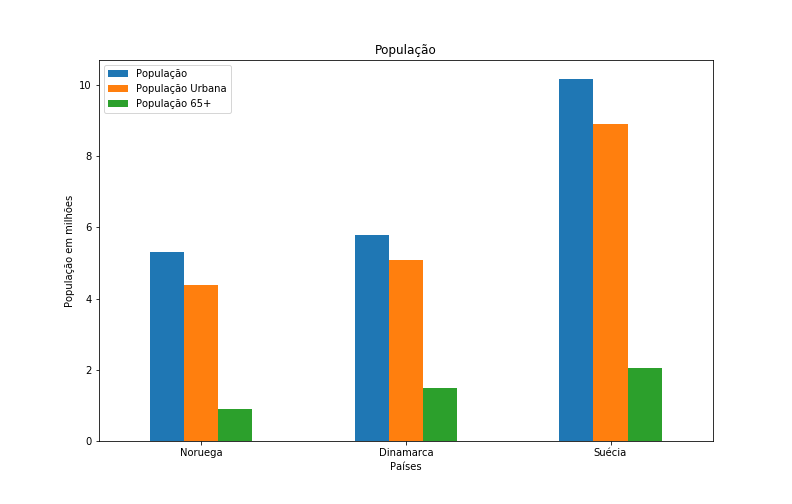
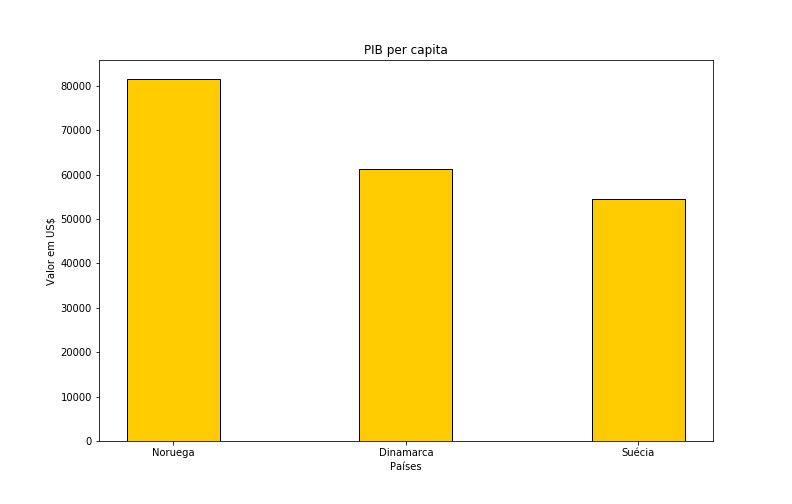
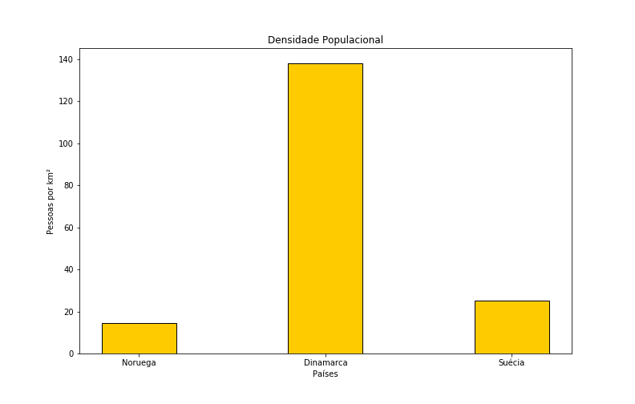
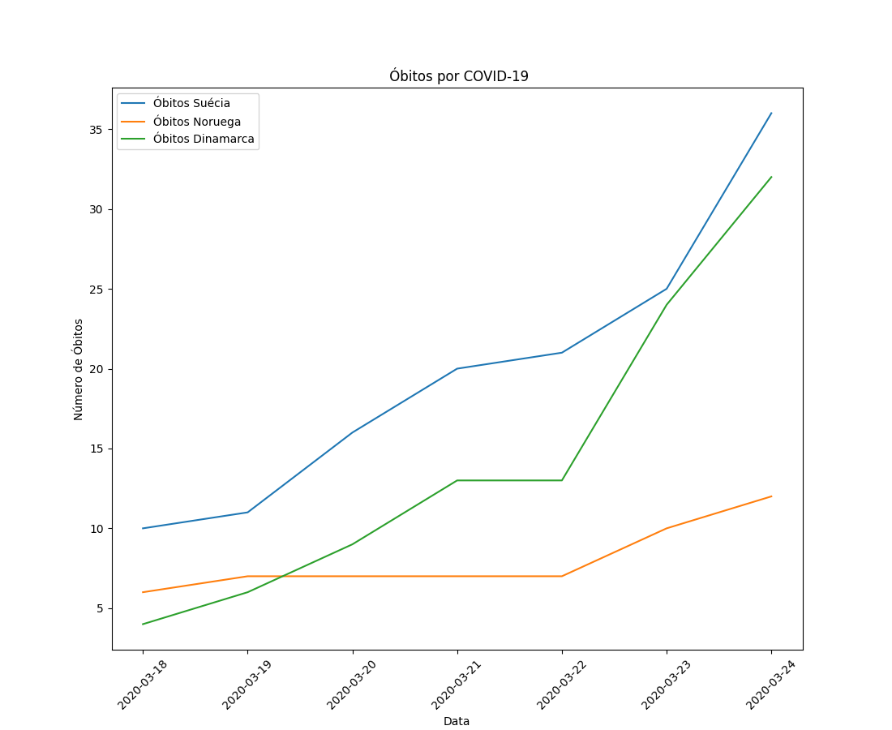
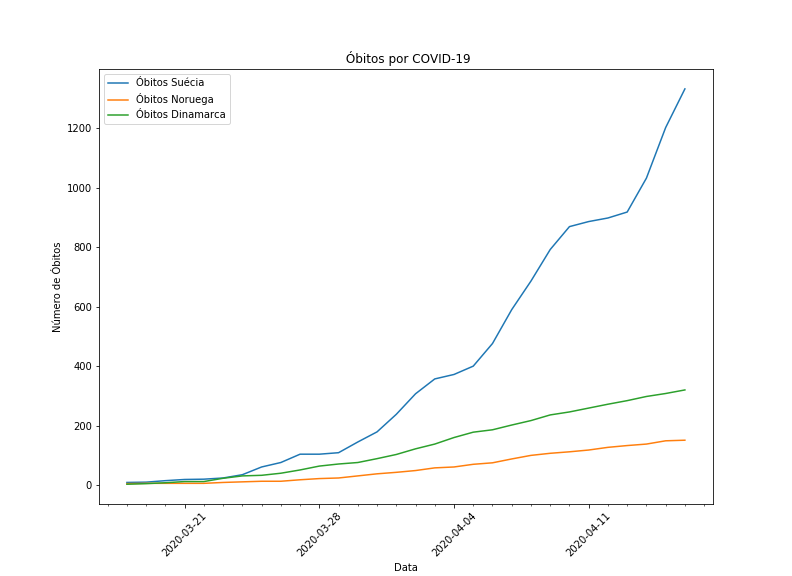
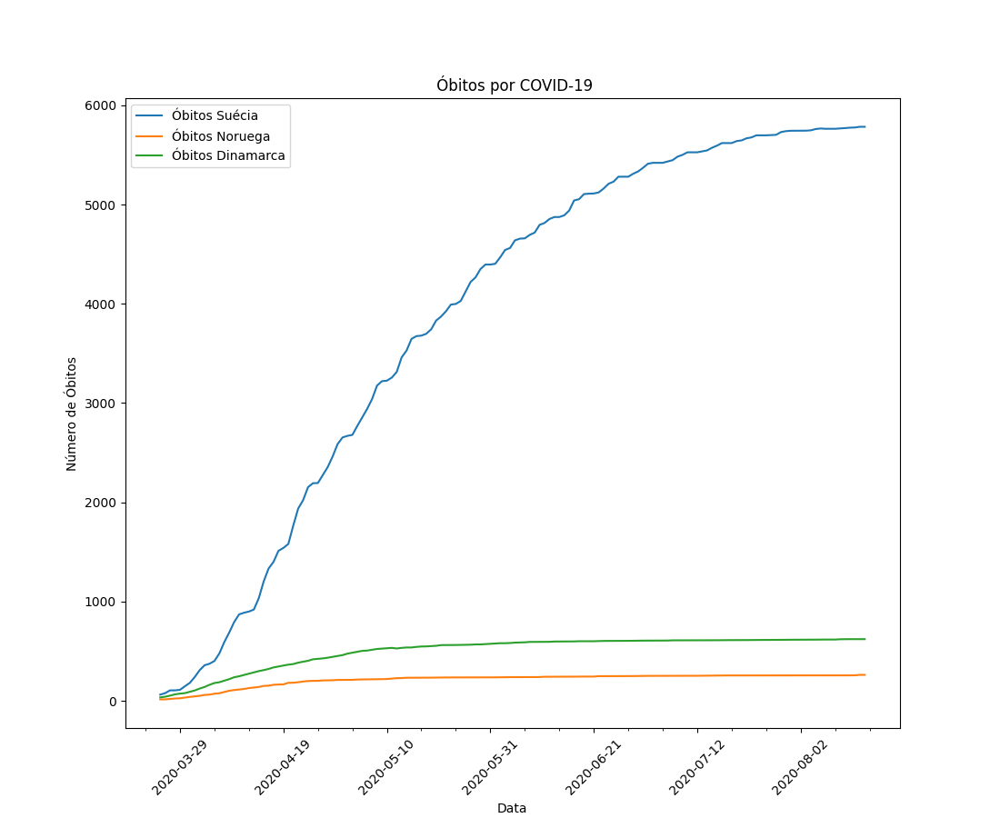

**RESUMO**

Fazer comparações de como uma pandemia se desenvolve em diferentes países é uma tarefa bem difícil, quando se deseja observar como a doença se comportou,pois cada país tem sua maneira de coletar os dados e de divulgar, tendo em vista isso este trabalho utilizou com objeto de estudo, três deles, Dinamarca, Noruega e Suécia,dada a semelhança existente entre as sociedades dos países nórdicos. Visando entender como foram as reações e quais os impactos delas na sociedade, o presente trabalho utilizou de dados divulgados sobre a COVID-19 para plotar gráficos e poder entender o comportamento da pandemia nesses países.Por fim foi visto que a maneira como cada país reagiu a chegada da pandemia,interferiu diretamente em seu impacto sobre a sociedade.

**Palavras-chave:** Países Nórdicos, COVID-19, analise de dados.

**INTRODUÇÃO**

Para entender a evolução da COVID-19 abreviação para *‘Corona Virus Disease’*, termo em inglês que significa doença do Coronavírus, o 19 se a refere ao ano 2019, quando foram registrados os primeiros casos da doença na China. Já para entender como ela se comportou nos países nórdicos, nesse estudo concentrado apenas em três (Dinamarca, Noruega e Suécia), é necessário entender como são as populações desses países, como funciona seu sistema de saúde e quais foram as medidas tomadas por seus governantes assim que a OMS *‘Organização Mundial da Saúde’* classificou a doença como uma pandemia, que quando a doença ganha uma proporção global e temos transmissões comunitárias em diferentes países do globo. 

A dificuldade de entender como funciona uma pandemia comparando diversos países está justamente nas particularidades que cada país tem e como os mesmos fazem a coleta de dados, qual as características de sua população, como são seus sistemas de saúde e em qual região do planeta estão. Por isso dada a semelhança das sociedades nórdicas e por serem vizinhos, escolhemos os países Dinamarca, Noruega e Suécia, que apesar de tão próximos adotaram medidas diferentes, então esse trabalho tem como objetivo utilizar de análises gráficas para entender como a doença se comportou nesses três países e por fim entendermos qual foi melhor estratégia. 

**DESENVOLVIMENTO**

**Fundamentação Teórica**

Para melhor entendimento dos dados disponíveis sobre a COVID-19 nos países nórdicos, vamos utilizar métodos gráficos, pela facilidade que se tem ao observa-los para possíveis tomadas de decisões. Para MORETTIN “*é mais fácil para qualquer pessoa entender a mensagem de um gráfico do que aquela embutida em tabelas ou sumários numéricos*”.  

Os gráficos são utilizados para diversos fins: 

    1. buscar padrões e relações; 
    2. confirmar (ou não) certas expectativas que se tinha sobre dados;
    3. descobrir novos fenômenos; 
    4. confirmar (ou não) suposições feitas sobre os procedimentos estatísticos usados; 
    5. apresentar resultados de modo mais rápido e fácil

Para escolhermos qual o melhor gráfico para representar as informações que temos nas planilhas de dados é necessário entendermos quais os tipos de variáveis, que podem ser qualitativas ou quantitativas. Para MORETTIN, variáveis **qualitativas** são aquelas que apresentam uma qualidade ou atributo do indivíduo pesquisado, como sexo, estado civil e nível educacional. Já variáveis **quantitativas** são resultantes de uma contagem ou mensuração, como número de filhos, salário e idade. Dentro das qualitativas tem pode-se fazer uma distinção entre dois tipos: **nominais** são aquelas que não existem ordenação nas possíveis realizações e **ordinal** para qual existe uma ordem nos seus resultados. Por sua vez as variáveis quantitativas também são divididas em duas, variáveis que formam um conjunto finito ou enumerável são chamadas de **discretas**, como por exemplo o número de filhos. Já valores que pertencem a um intervalo de números reais e que resultam numa mensuração são chamadas de **contínuas**, como o salário. 

Existem vários tipos de gráficos para representar variáveis qualitativas e quantitativas, focaremos em dois tipos, gráficos de barras e gráficos de linha. O gráfico de barras consiste em construir retângulos ou barras, em que uma das dimensões é proporcional à magnitude a ser representada, sendo a outra arbitrária, porém igual para todas as barras. Já gráficos de linhas mostram tendências ou alterações ao longo tempo, são utilizados quando se tem variáveis quantitativas. 

**Metodologia**

Tendo em vista a dificuldade que é comparar diferentes países em um cenário pandêmico, decidimos começar analisando a população do país com o intuito de entender as similaridades que as mesmas possuem. Então utilizando bancos de dados disponíveis no site [Population Pyramid](https://www.populationpyramid.net/), foram coletados os dados da população da Noruega, Dinamarca e Suécia para a plotagem das pirâmides vistas na figura ?? 




Observamos que os países possuem populações semelhantes quanto a faixa de idade. 
Nota-se que os países possuem populações semelhantes quanto a faixa de idade. Com significativas parcelas da população com idade maior que 65 anos. Para a OMS pessoas acima de 60 anos estão no grupo de risco, pois essas têm mais chances de terem seus quadros clínicos agravados para desenvolvendo uma síndrome respiratória aguda. Observando isso traçamos um gráfico com dados óbitos ‘\emph{United Nations Development Programme}’ (UNDP), que significa programa de desenvolvimento das nações unidas.Criando a tabela mostrada na figura ?? 


Assim obtemos o gráfico da figura ?? 

 Para uma boa analise dos países é necessário utilizar de outros indicadores socioeconômicos, tais como PIB per capita e densidade populacional, no gráfico da figura \ref{fig:pop}, percebemos que todos países tem uma taxa elevada de urbanização, pois a população urbana corresponde a mais de $80\%$  da população do países e a população com mais de 65 anos está entre $15\%$ e $25\%$. 
 Com intuito de melhorar nossa análise também traçamos os gráficos do PIB per capita mostrado na figura \ref{fig:ppp} e o gráfico do Densidade Populacional mostrado na figura \ref{fig:dp}, dados também obtidos através da UNDP. 





Para terminamos a comparação entre países também traçamos um gráfico comparando seus Índices de Desenvolvimento Humano, mostrado na figura \ref{fig:idh}.
Todos os três países possuem o IDH acima de 0.9, quando o máximo é 1.0, então temos uma análise de países bem semelhantes em sua sociedade, fator importante quando se trata em comparar como foi o comportamento da pandemia em diferentes países. Segundo pesquisadores ingleses, ao se comparar efeitos da pandemia em diferentes países é necessário levar em conta:


    -Como está sendo feita a contagem dos óbitos
    -Taxas de mortalidade
    -Fatores Políticos
    -Fatores Populacionais
    -Serviços de saúde
    -Quantidade de testes


 A escolha dos países já mencionados neste trabalho buscar diminuir tais diferenças listadas, já que elas são fatores importantes para obtermos informações que possam ajudar no aprendizado das nações diante de uma pandemia. Desses fatores listados vimos que os fatores populacionais são atendidos, pois temos sociedades muito parecidas.
 Outro fator atendido é a semelhança existente nos serviços de saúde, segundo artigo pulicado no site  [*healthmanagement.org*](https://healthmanagement.org/c/cardio/issuearticle/overview-of-the-healthcare-systems-in-the-nordic-countries)
 , todos os países nórdicos possuem padrões sofisticados de saúde ocupacional, considerados modelos e ainda sistemas hospitalares bem desenvolvidos. Sendo esse sistema baseado em impostos administrados localmente, em que todos os cidadãos tem acesso igual aos serviços.
 O fator politico há algumas diferenças enquanto Dinamarca e Noruega os tem uma participação maior na administração, na Suécia se tem ministérios comparativamente pequenos e autoridades administrativas autônomas, afirma STRANG.


**Resultados e discussões**

Dentre os três países analisados neste trabalho, a Suécia foi a única que decidiu não adotar uma medida mais severa de isolamento social, segundo STRANG, as maneiras como os diferentes governos se organizam foi a principal causa para medidas diferentes.  

Enquanto o governo dinamarquês impôs restrições rapidamente e fechou suas fronteiras, a Suécia seguia 'sozinha', sendo o único país nórdico, e um dos poucos países da Europa, que não fechou suas escolas e introduziu medidas de distanciamento social rigorosas e legalmente aplicadas. Segundo STRANG, *'existe uma forte tradição na Suécia de pensar que uma economia funcional é um pré-requisito para o bem-estar e saúde das pessoas'*. Ele também explica que pôr a Suécia ser conhecida como uma sociedade paternalista, as autoridades acreditam que os suecos em geral seguirão as recomendações do epidemiologista do estado, para lavar as mãos e ficaram longe uns dos outros. Tendo em vista esse cenário vamos ver como se comportaram os números de óbitos nos três países já mencionados nesse estudo. 

De acordo com Report 13 do Imperial College, as mortes que ocorrem no início da pandemia são de pessoas que se infectaram fora do país. Por isso fizemos duas tabelas uma a data em que os países atingiram 10 óbitos \ref{fig:table_10} e quando contabilizaram 50 óbitos \ref{fig:table_50}


Traçando o gráfico da primeira semana após o primeiro país, entre os três estudados aqui ter contabilizado 10 óbitos observamos as seguintes curvas na figura \ref{fig:first_week}.



Observando as inclinações da figura \ref{fig:first_week},podemos entender porque a Dinamarca decidiu por fechar suas fronteiras, enquanto que a Suécia com a mesma inclinação não adotou nenhuma medida restritiva.



Para ver os efeitos após um mês traçamos o gráfico da figura \ref{fig:first_month}, veja que a inclinação da curva da Dinamarca diminuiu sua inclinação,  enquanto a da Suécia continua crescente. Para vermos o resultado até do dia 15 de agosto de 2020, traçamos o gráfico da figura \ref{fig:d50}.



Ao observamos o gráfico da figura \ref{fig:d50}, vemos que a Dinamarca conseguiram achatar suas curvas bem antes da Suécia, que é continuou numa crescente, vindo a achatar a curva apenas no mês de agosto.

Tendo em vista que a Suécia foi o País mais atingindo pela pandemia,quando comparado a Dinamarca e Noruega,decidimos plotar  um gráfico comparando quais foram as faixas etárias mas atingidas nos três países.


A o gráfico da figura \ref{fig:SwedenXDenmark} mostrou que a população idosa foi a mais atingida, tanto na Dinamarca quanto na Suécia.

Fizemos a mesma comparação para Noruega e Suécia, como mostra a figura \ref{fig:SwedenXNorway}.


Observando o gráfico da  figura  \ref{fig:SwedenXNorway} vemos que o comportamento para os óbitos em relação a faixa etária foi semelhante para os três países, tendo o maior número de óbitos na pessoas com idade entre 80 e 89 anos.


### CONCLUSÃO


Com estudo feito sobre a evolução da COVID-19 em três dos países nórdicos que tem por característica sociedades bem semelhantes entre sim, quando comparamos dados socioeconômicos, podemos ver que a decisão tomada pela Suécia de não impor um isolamento social, fechando  escolas, comércios e parando o transporte público foi bem danoso para sociedade sueca, principalmente para os mais idosos, que como os gráficos mostraram essa foi a população mais atingida. 

Foi visto também que os países Dinamarca e Noruega que optaram por adotar medidas mais rígidas, promovendo o isolamento social, tiveram menos danos em suas sociedades e conseguiram controlar a pandemia bem mais cedo do que a Suécia. 


### APÊNDICE


Códigos em Python utilizados para plotagem dos gráficos e criação das tabelas.


#### Piramides Etárias


```python
import pandas as pd
import matplotlib.pyplot as plt
import matplotlib.dates as mdates

def create_pyramids(countries):
    '''
    Recebe  um dicionário em que as chaves
    são os nomes dos países em português e
    os valores são dataframes,  contendo as
    populações divididas por faixa etária.
    '''
    t=0
    fig,ax=plt.subplots(1,len(countries),figsize=(15,7),sharex=True)
    for i in countries.items():
        M=i[1]['M']
        F=i[1]['F']
        Age=i[1]['Age']
        ax[t].barh(Age,-M,label='Masculino',color='blue')
        ax[t].barh(Age,F,label='Feminino',color='red')
        ax[t].legend()
        plt.xticks([])
        ax[t].set_xlabel(i[0])  
        t+=1
    
    fig.savefig('pyramids.png')

denmark=pd.read_csv('Denmark-2019.csv',sep=',')

norway=pd.read_csv('Norway-2019.csv',sep=',')

sweden=pd.read_csv('Sweden-2019.csv',sep=',')

countries={'Dinamarca':denmark,'Noruega':norway,'Suécia':sweden}
create_pyramids(countries)
```

#### População


```python
import weasyprint as wsp
import PIL as pil
import pandas as pd

indicators=pd.read_csv('indicators.csv',sep=',')
pop=pd.concat([indicators['Países'],indicators['População'],indicators['População Urbana'],indicators['População 65+']],axis=1)
temp=(pop['População Urbana']/pop['População'])*100
temp.name='População Urbana (%)'
pop=pd.concat([pop,temp],axis=1)
temp=(pop['População 65+']/pop['População'])*100
temp.name='População 65+ (%)'
pop=pd.concat([pop,temp],axis=1)

def trim(source_filepath, target_filepath=None, background=None):
    if not target_filepath:
        target_filepath = source_filepath
    img = pil.Image.open(source_filepath)
    if background is None:
        background = img.getpixel((0, 0))
    border = pil.Image.new(img.mode, img.size, background)
    diff = pil.ImageChops.difference(img, border)
    bbox = diff.getbbox()
    img = img.crop(bbox) if bbox else img
    img.save(target_filepath)


img_filepath = 'pop_table.png'
css = wsp.CSS(string='''
@page { size: 2048px 2048px; padding: 0px; margin: 0px; }
table, td, tr, th { border: 1px solid black; }
td, th { padding: 4px 8px; }
''')
html = wsp.HTML(string=pop.to_html())
html.write_png(img_filepath, stylesheets=[css])
trim(img_filepath)
```

#### Indicadores


```python
import weasyprint as wsp
import PIL as pil
import pandas as pd

indicators=pd.read_csv('indicators.csv',sep=',')
pop=pd.concat([indicators['Países'],indicators['População'],indicators['População Urbana'],indicators['População 65+']],axis=1)
temp=(pop['População Urbana']/pop['População'])*100
temp.name='População Urbana (%)'
pop=pd.concat([pop,temp],axis=1)
temp=(pop['População 65+']/pop['População'])*100
temp.name='População 65+ (%)'
pop=pd.concat([pop,temp],axis=1)

def trim(source_filepath, target_filepath=None, background=None):
    if not target_filepath:
        target_filepath = source_filepath
    img = pil.Image.open(source_filepath)
    if background is None:
        background = img.getpixel((0, 0))
    border = pil.Image.new(img.mode, img.size, background)
    diff = pil.ImageChops.difference(img, border)
    bbox = diff.getbbox()
    img = img.crop(bbox) if bbox else img
    img.save(target_filepath)


img_filepath = 'pop_table.png'
css = wsp.CSS(string='''
@page { size: 2048px 2048px; padding: 0px; margin: 0px; }
table, td, tr, th { border: 1px solid black; }
td, th { padding: 4px 8px; }
''')
html = wsp.HTML(string=pop.to_html())
html.write_png(img_filepath, stylesheets=[css])
trim(img_filepath)
```

#### Óbitos por País


```python
import weasyprint as wsp
import PIL as pil
import pandas as pd
import matplotlib.pyplot as plt
import matplotlib.dates as mdates

url='https://raw.githubusercontent.com/datasets/covid-19/master/data/countries-aggregated.csv'
countries_covid=pd.read_csv(url,sep=',')

def trim(source_filepath, target_filepath=None, background=None):
    '''
    Recebe uma imagem e recorta, para um tamanho que 
    comporte os dados.
    '''
    if not target_filepath:
        target_filepath = source_filepath
    img = pil.Image.open(source_filepath)
    if background is None:
        background = img.getpixel((0, 0))
    border = pil.Image.new(img.mode, img.size, background)
    diff = pil.ImageChops.difference(img, border)
    bbox = diff.getbbox()
    img = img.crop(bbox) if bbox else img
    img.save(target_filepath)

def countries_deaths(df,number,countries):
    '''
     Recebe um dataframe,um número inteiro que diz
     respeito número de óbitos que se deseja buscar
     e por fim recebe um dicionário com os nomes dos 
     países em inglês e português.
    '''
    indexes=[]
    deaths=pd.DataFrame()
    for country in countries.keys():
        temp=df.set_index('Date').query('Country== @country and Deaths>=@number')['Deaths']
        indexes.append(temp.index[0])
    index=min(indexes)
    for country in nordics.keys():
        temp=df.set_index('Date').query('Country== @country and Date>=@index')['Deaths']
        temp.name='Óbitos '+countries[country]
        deaths=pd.concat([deaths,temp],axis=1)
    return deaths

def countries_deaths_graphic(df,days):
    '''
    Recebe um dataframe e número de dias que 
    se deseja plotar o gráfico.
    '''
    df=df.head(days)
    fig,ax=plt.subplots(figsize=(11,9))
    for name in ['Óbitos Suécia','Óbitos Noruega','Óbitos Dinamarca']:
        ax.plot(pd.to_datetime(df.index),df[name],label=name)
    ax.set_xlabel('Data') 
    ax.set_ylabel('Número de Óbitos') 
    ax.set_title(' Óbitos por COVID-19')
    ax.legend()
    if days<=7:
        ax.xaxis.set_major_locator(mdates.DayLocator(interval=1))
    elif days<=30:
        ax.xaxis.set_minor_locator(mdates.DayLocator(interval=1)) 
        ax.xaxis.set_major_locator(mdates.DayLocator(interval=7))
    else:
        ax.xaxis.set_minor_locator(mdates.DayLocator(interval=7)) 
        ax.xaxis.set_major_locator(mdates.DayLocator(interval=21))
            
    labels = ax.get_xticklabels()
    plt.setp(labels, rotation=45)
    fig.savefig('day_'+str(days)+'_deaths.png')
    
nordics={'Sweden':'Suécia','Norway':'Noruega','Denmark':'Dinamarca'}
d10=countries_deaths(countries_covid,10,nordics).fillna(0)
countries_deaths_graphic(d10,7)
d10=countries_deaths(countries_covid,10,nordics).fillna(0)
countries_deaths_graphic(d10,30)
d50=countries_deaths(countries_covid,50,nordics).fillna(0)
countries_deaths_graphic(d50,len(d50))

img_filepath = 'd10_table.png'
css = wsp.CSS(string='''
@page { size: 2048px 2048px; padding: 0px; margin: 0px; }
table, td, tr, th { border: 1px solid black; }
td, th { padding: 4px 8px; }
''')
html = wsp.HTML(string=d10.head(6).to_html())
html.write_png(img_filepath, stylesheets=[css])
trim(img_filepath)

img_filepath = 'd50_table.png'
css = wsp.CSS(string='''
@page { size: 2048px 2048px; padding: 0px; margin: 0px; }
table, td, tr, th { border: 1px solid black; }
td, th { padding: 4px 8px; }
''')
html = wsp.HTML(string=d50.head(9).to_html())
html.write_png(img_filepath, stylesheets=[css])
trim(img_filepath)
```

##### Óbitos por Idade


```python
import pandas as pd
import matplotlib.pyplot as plt
import matplotlib.dates as mdates

def death_by_age_graphic(nordics):
    death_by_age=pd.DataFrame()
    for country in nordics.keys():
        temp=pd.read_csv('deaths_by_age_'+country+'.csv',sep=',',index_col=0).fillna(0)
        death_by_age=pd.concat([death_by_age,temp],axis=1).rename(columns={"Deaths":"Óbitos por idade "+nordics[country]})
    
    return death_by_age

death_by_age=death_by_age_graphic({'sweden':'Suécia','norway':'Noruega','denmark':'Dinamarca'})
fig,ax=plt.subplots(figsize=(11,7))
ax.barh(death_by_age.index,death_by_age['Óbitos por idade Suécia'], label='Óbitos por idade Suécia',color='#FECB00')
ax.barh(death_by_age.index,death_by_age['Óbitos por idade Noruega'],label='Óbitos por idade Noruega',color='#EF2B2D')
ax.set_xlabel('Número de Óbitos')
ax.set_ylabel('Idade')
ax.legend()
fig.savefig('SwedenXNorway.png')

fig,ax=plt.subplots(figsize=(11,7))
ax.barh(death_by_age.index,death_by_age['Óbitos por idade Suécia'], label='Óbitos por idade Suécia',color='#FECB00')
ax.barh(death_by_age.index,death_by_age['Óbitos por idade Dinamarca'],label='Óbitos por idade Dinamarca',color='#C60C30')
ax.set_xlabel('Número de Óbitos')
ax.set_ylabel('Idade')
ax.legend()
fig.savefig('SwedenXDenmark.png')
```
